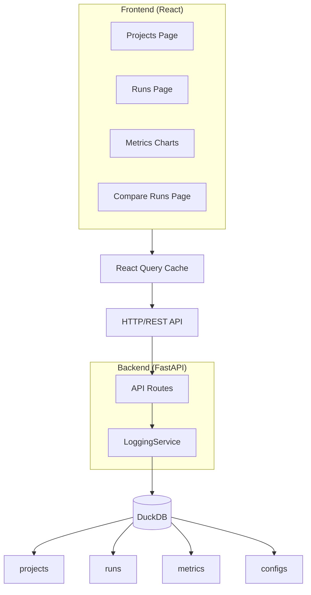
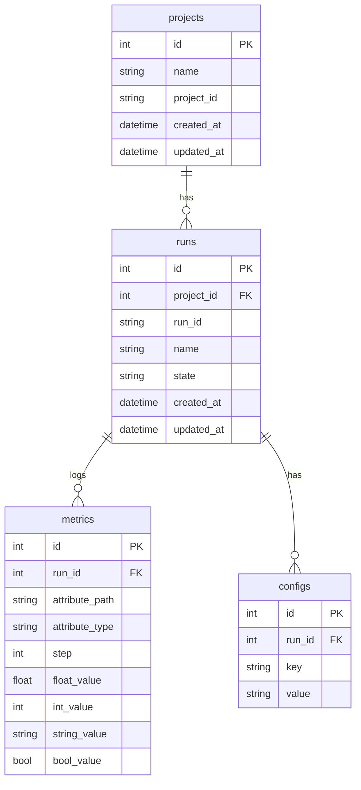
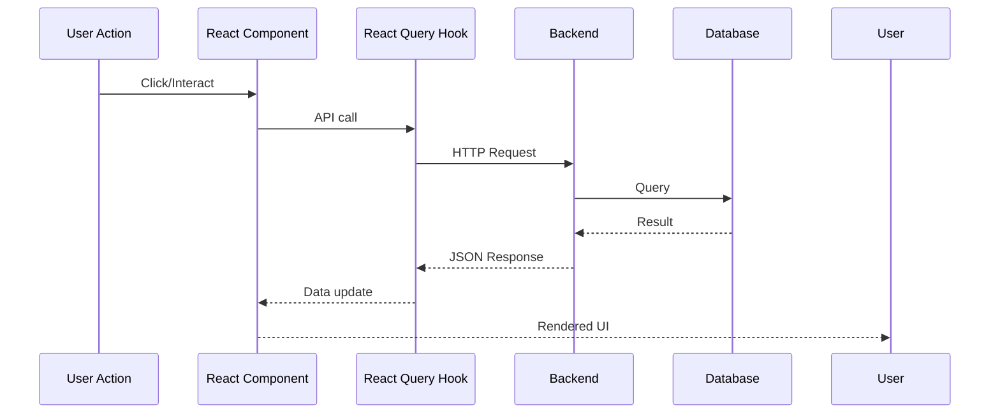

# Architecture

This document describes Dalva's internal architecture.

## System Overview

Dalva is a full-stack application with:

- **Backend**: FastAPI + SQLAlchemy + DuckDB
- **Frontend**: React + TypeScript + Vite
- **Database**: DuckDB (SQLite-like, file-based)



## Backend Architecture

### Key Design Decisions

#### 1. Short-Lived Sessions (DuckDB Compatibility)

DuckDB allows **one writer per file** across OS processes. The old design held sessions open during training, blocking the web server.

**Solution**: Every `LoggingService` method opens a fresh session, writes, commits, and closes immediately:

```python
def log_metrics(self, run_id, metrics, step=None):
    with session_scope() as db:  # Opens session
        for metric_path, value in metrics.items():
            db.add(Metric(...))
    # Session automatically closed here
```

#### 2. EAV Model for Metrics

The `Metric` table uses an Entity-Attribute-Value model for flexibility:

```sql
CREATE TABLE metrics (
    id INTEGER PRIMARY KEY,
    run_id INTEGER REFERENCES runs(id),
    attribute_path TEXT,      -- e.g., "train/loss"
    attribute_type TEXT,     -- e.g., "float_series"
    step INTEGER,            -- NULL for summary, int for series
    float_value REAL,
    int_value INTEGER,
    string_value TEXT,
    bool_value BOOLEAN
);
```

This allows logging arbitrary metrics without schema changes.

#### 3. Series vs Scalar Types via Step

The `step` parameter determines metric type:

| Step Value | Type Suffix | Example |
|------------|-------------|---------|
| `None` | (none) | `float`, `int`, `string`, `bool` |
| `0, 1, 2, ...` | `_series` | `float_series`, `int_series`, etc. |

This is enforced at write time - attempting to write a different type for the same metric key raises an error.

### Database Schema



## Frontend Architecture

### Data Flow



### React Query Configuration

```typescript
const queryClient = new QueryClient({
  defaultOptions: {
    queries: {
      staleTime: 30_000,      // 30 seconds
      refetchOnWindowFocus: false,
    },
  },
});
```

### Chart Rendering Logic

The `MetricViewer` component decides how to render a metric based on its type:

```typescript
const isSeries = attributeType?.endsWith('_series') ?? false;

if (isSeries) {
  // Render interactive chart with Plotly
  return <MetricChart data={values} hasSteps={hasSteps} />;
} else {
  // Render single value card
  return <ValueCard value={values[0].value} />;
}
```
