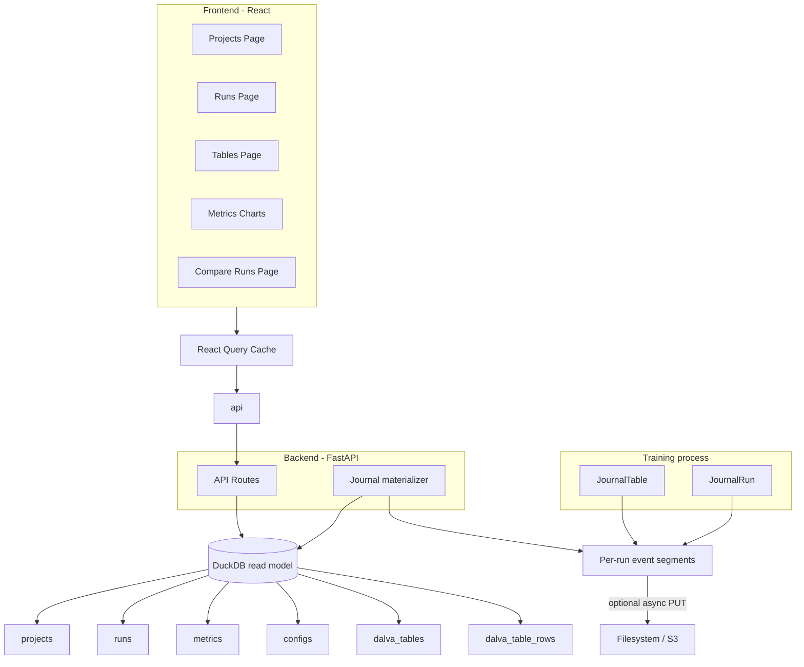
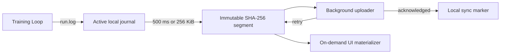
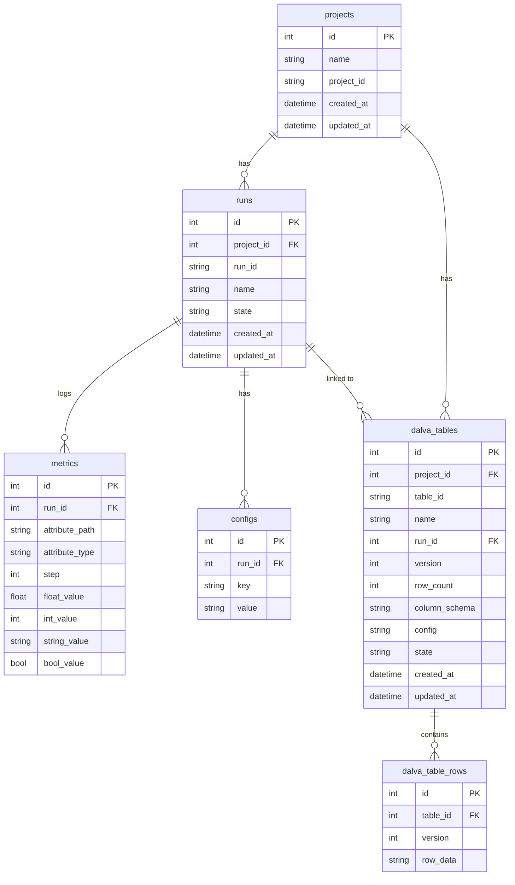
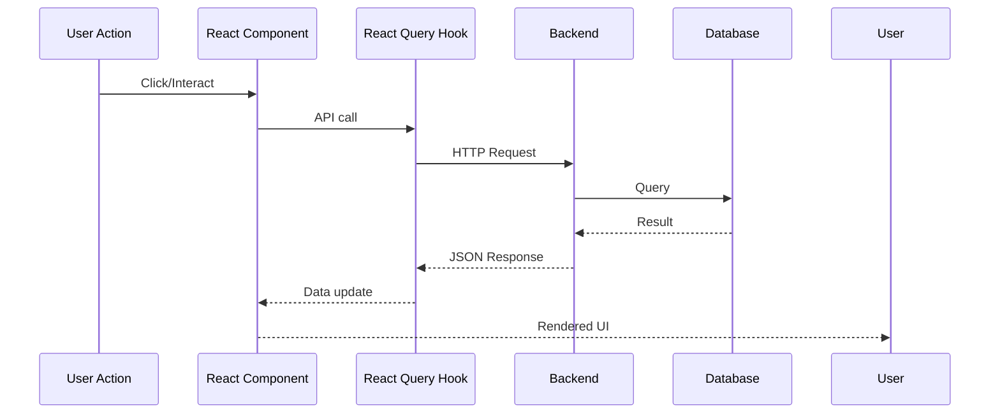

# Architecture

This document describes Dalva's internal architecture.

## System Overview

Dalva separates durable experiment capture from the on-demand query UI:

- **SDK**: Per-run append-only journals; no server connection by default
- **Replication**: Immutable filesystem or S3-compatible segments
- **Backend**: On-demand FastAPI materializer + SQLAlchemy + DuckDB
- **Frontend**: React + TypeScript + Vite
- **Database**: DuckDB (SQLite-like, file-based)


```mermaid
graph TB
subgraph SDK["Training process"]
    sdk_run["JournalRun"]
    sdk_table["JournalTable"]
end
sdk_run --> journal["Per-run event segments"]
sdk_table --> journal
journal -->|"optional async PUT"| objects["Filesystem / S3"]
subgraph FE["Frontend - React"]
    fe_proj[Projects Page]
    fe_runs[Runs Page]
    fe_tables[Tables Page]
    fe_metrics[Metrics Charts]
    fe_compare[Compare Runs Page]
end
FE --> rq[React Query Cache]
rq --> api
subgraph BE["Backend - FastAPI"]
    importer["Journal materializer"]
    routes[API Routes]
end
importer --> journal
api --> routes
importer --> db[(DuckDB read model)]
routes --> db
db --> tbl_projects[projects]
db --> tbl_runs[runs]
db --> tbl_metrics[metrics]
db --> tbl_configs[configs]
db --> tbl_dalva_tables[dalva_tables]
db --> tbl_dalva_rows[dalva_table_rows]
```

## Daemonless Journal Architecture

`log()` appends to the run's local journal before it returns. A background worker
only handles replication, so a slow or unavailable network never removes the
local durability guarantee.

### Data Flow


```mermaid
graph LR
    TL[Training Loop] -->|"run.log"| ACTIVE["Active local journal"]
    ACTIVE -->|"500 ms or 256 KiB"| SEG["Immutable SHA-256 segment"]
    SEG --> UP["Background uploader"]
    UP -->|"acknowledged"| ACK["Local sync marker"]
    UP -->|"retry"| SEG
    SEG --> UI["On-demand UI materializer"]
```

### Components

| Component | File | Purpose |
|-----------|------|---------|
| `SegmentedJournal` | `sdk/journal.py` | Durable append, rotation, checksums, sync barriers |
| `SegmentUploader` | `sdk/journal.py` | Background retry and acknowledgement tracking |
| `FileTransport` / `S3Transport` | `sdk/transport.py` | Idempotent immutable replication |
| `JournalRun` / `JournalTable` | `sdk/local.py` | Daemonless public SDK resources |
| Journal materializer | `services/journal_import.py` | Idempotent journal → DuckDB projection |

### Durability Behavior

- **Balanced mode**: each event is flushed from Python to the operating system
  before `log()` returns; segment rotation performs an fsync.
- **Strict mode**: every event is fsynced before `log()` returns.
- **Replication**: local segments are never deleted after upload failures.
- **`flush()`**: establishes a local fsync barrier.
- **`sync()`**: rotates the active segment and waits for remote acknowledgement.
- **`finish()`**: writes completion, synchronizes, and retains local data.

### Journal Event Format

Stored below `~/.dalva/runs/<run-id>/events/`:

```jsonl
{"version":1,"seq":1,"timestamp":"...","type":"run_created","payload":{"project":"demo"}}
{"version":1,"seq":2,"timestamp":"...","type":"metrics_logged","payload":{"metrics":{"loss":0.5},"step":0}}
{"version":1,"seq":3,"timestamp":"...","type":"run_finished","payload":{"state":"completed"}}
```

### Key Parameters

| Parameter | Default | Description |
|-----------|---------|-------------|
| `segment_bytes` | 256 KiB | Size-triggered segment rotation |
| `segment_interval` | 0.5s | Time-triggered segment rotation |
| `durability` | `balanced` | Local acknowledgement policy |
| `runs_dir` | `~/.dalva/runs/` | Canonical local journal root |

## Legacy HTTP Mode

Passing `server_url` or setting `DALVA_SERVER_URL` selects the previous HTTP
client. Its WAL is now also persisted before requests enter the in-memory queue,
removing the former worker-pickup loss window.

## Backend Architecture

### Key Design Decisions

#### 1. Short-Lived Sessions (DuckDB Compatibility)

DuckDB allows **one read-write process per file**. Training processes therefore
never open the shared DuckDB database. The on-demand UI is its sole owning
process and incrementally materializes journal events. Sessions inside that
process are still intentionally short-lived:

```python
def log_metrics(run_id, metrics, step=None):
    with session_scope() as db:  # Opens session
        for metric_path, value in metrics.items():
            db.add(Metric(...))
    # Session automatically closed here
```

#### 2. EAV Model for Metrics

The `Metric` table uses an Entity-Attribute-Value model for flexibility:

```sql
CREATE TABLE metrics (
    id INTEGER PRIMARY KEY,
    run_id INTEGER REFERENCES runs(id),
    attribute_path TEXT,      -- e.g., "train/loss"
    attribute_type TEXT,     -- e.g., "float_series"
    step INTEGER,            -- NULL for summary, int for series
    float_value REAL,
    int_value INTEGER,
    string_value TEXT,
    bool_value BOOLEAN
);
```

This allows logging arbitrary metrics without schema changes.

#### 3. Series vs Scalar Types via Step

The `step` parameter determines metric type:

| Step Value | Type Suffix | Example |
|------------|-------------|---------|
| `None` | (none) | `float`, `int`, `string`, `bool` |
| `0, 1, 2, ...` | `_series` | `float_series`, `int_series`, etc. |

This is enforced at write time - attempting to write a different type for the same metric key raises an error.

### Database Schema


```mermaid
erDiagram
    projects {
        int id PK
        string name
        string project_id
        datetime created_at
        datetime updated_at
    }
    
    runs {
        int id PK
        int project_id FK
        string run_id
        string name
        string state
        datetime created_at
        datetime updated_at
    }
    
    metrics {
        int id PK
        int run_id FK
        string attribute_path
        string attribute_type
        int step
        float float_value
        int int_value
        string string_value
        bool bool_value
    }
    
    configs {
        int id PK
        int run_id FK
        string key
        string value
    }
    
    dalva_tables {
        int id PK
        int project_id FK
        string table_id
        string name
        int run_id FK
        int version
        int row_count
        string column_schema
        string config
        string state
        datetime created_at
        datetime updated_at
    }
    
    dalva_table_rows {
        int id PK
        int table_id FK
        int version
        string row_data
    }
    
    projects ||--o{ runs : "has"
    projects ||--o{ dalva_tables : "has"
    runs ||--o{ metrics : "logs"
    runs ||--o{ configs : "has"
    runs ||--o{ dalva_tables : "linked to"
    dalva_tables ||--o{ dalva_table_rows : "contains"
```

## Frontend Architecture

### Data Flow


```mermaid
sequenceDiagram
    User Action->>React Component: Click/Interact
    React Component->>React Query Hook: API call
    React Query Hook->>Backend: HTTP Request
    Backend->>Database: Query
    Database-->>Backend: Result
    Backend-->>React Query Hook: JSON Response
    React Query Hook-->>React Component: Data update
    React Component-->>User: Rendered UI
```

### React Query Configuration

```typescript
const queryClient = new QueryClient({
  defaultOptions: {
    queries: {
      staleTime: 30_000,      // 30 seconds
      refetchOnWindowFocus: false,
    },
  },
});
```

### Chart Rendering Logic

The `MetricViewer` component decides how to render a metric based on its type:

```typescript
const isSeries = attributeType?.endsWith('_series') ?? false;

if (isSeries) {
  // Render interactive chart with Plotly
  return <MetricChart data={values} hasSteps={hasSteps} />;
} else {
  // Render single value card
  return <ValueCard value={values[0].value} />;
}
```
